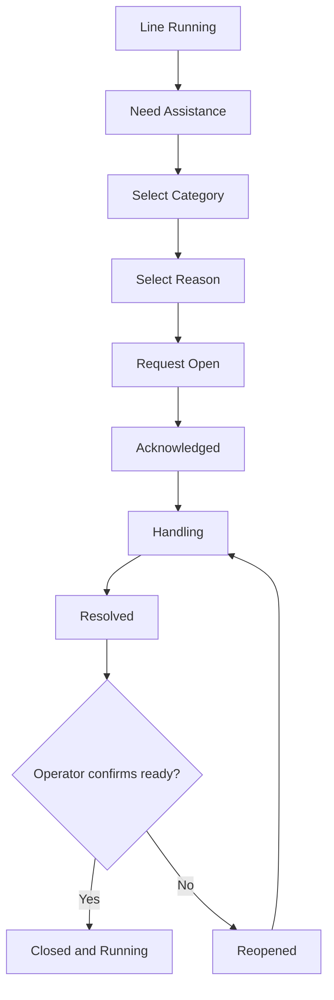

# Product Requirements Document — Digital Andon System

| Field | Value |
|---|---|
| Product | Digital Andon System for Pipe Production |
| Version | 1.0 |
| Status | Draft for MVP implementation |
| Primary terminal | ESP32 3.5-inch capacitive touchscreen, 480×320 landscape |
| Backend | Node.js/Fastify, MQTT, PostgreSQL |
| Updated | 2026-08-11 |

## 1. Executive summary

Digital Andon is a shop-floor assistance and incident-response system for pipe-production lines. An operator uses a compact ESP32 touchscreen to call Maintenance, Quality, Material, or a Supervisor in at most three taps. The system records the event, starts a downtime timer, notifies the responsible team, tracks acknowledgement and handling, and requires the operator to confirm that the line is ready before production resumes.

The product is not an emergency-stop system and does not replace machine safety circuits. It is the operator interaction layer for production assistance, while workflow, escalation, history, analytics, authentication, and integrations are controlled by the backend.

## 2. Problem statement

Production interruptions are frequently reported through verbal calls, radio, chat, or informal messages. This creates several problems:

- The responsible team may not receive the request quickly.
- Operators cannot see whether anyone has acknowledged the request.
- Start, response, handling, and completion times are not recorded consistently.
- Downtime reasons are entered late or based on memory.
- Repeated failures and material delays are difficult to identify.
- Management cannot reliably calculate response time, recovery time, or downtime by line.

## 3. Product goals

### 3.1 Business goals

- Reduce the average time between an operator request and team acknowledgement.
- Produce reliable downtime and response data for continuous improvement.
- Standardize assistance categories and issue reasons across production lines.
- Give operators visible feedback that a request is being handled.
- Enable escalation without relying on manual follow-up.
- Provide an integration point for ERP, CMMS, maintenance, or production systems.

### 3.2 User goals

- Submit a request in no more than three deliberate taps.
- See the active request, elapsed time, owner, and status at a glance.
- Continue operating during temporary Wi-Fi or backend interruptions.
- Avoid typing on the 3.5-inch screen for normal workflows.
- Confirm that the machine is ready before returning the line to `RUNNING`.

### 3.3 Success metrics

| Metric | Definition | Initial target |
|---|---|---:|
| Request completion | Valid requests successfully stored by the backend | ≥ 99.5% |
| Median submission time | `NEED ASSISTANCE` to request confirmation | ≤ 15 seconds |
| MTTA | Request opened to acknowledged | Establish baseline, then reduce by 20% |
| MTTR | Request opened to resolved | Establish baseline, then reduce by 10% |
| Reason completeness | Closed incidents containing a valid category and reason | ≥ 98% |
| Duplicate request rate | Duplicate active request for the same station/category | < 1% |
| Terminal availability | Terminal usable for local request entry | ≥ 99% during operating hours |

## 4. Non-goals

The MVP will not:

- Replace emergency-stop buttons, safety PLCs, interlocks, alarms, or certified safety systems.
- Directly control machine motion, power, valves, or hazardous equipment.
- Become a full manufacturing execution system.
- Provide advanced predictive maintenance or machine-learning diagnosis.
- Store ERP credentials or connect the ESP32 directly to an ERP database.
- Support free-form chat or long text entry on the terminal.
- Calculate employee performance rankings from individual incident data.

## 5. Users and roles

| Role | Primary need | Permissions |
|---|---|---|
| Production operator | Request assistance and confirm recovery | Open, view, cancel before acknowledgement, add preset note, confirm ready |
| Maintenance technician | Respond to machine or utility problems | Acknowledge, start handling, add action, resolve |
| Quality inspector | Respond to quality holds | Acknowledge, hold/release, record disposition, resolve |
| Material handler | Respond to material requests | Acknowledge, fulfill, resolve |
| Shift supervisor | Coordinate and escalate | View all, acknowledge, reassign, override with reason, close exceptional cases |
| Administrator | Configure stations and rules | Manage master data, users, mappings, escalation, devices |
| Manager/analyst | Analyze operations | Read dashboards, reports, exports, and trends |
| Integration service | Exchange system data | Machine-to-machine access to approved endpoints only |

## 6. Operating assumptions

- Each terminal is assigned to one station and normally one production line.
- The terminal runs in landscape orientation at 480×320 pixels.
- MQTT is used for near-real-time commands and events.
- HTTPS REST endpoints are used for configuration, history, and reconciliation.
- The backend timestamp is authoritative for official KPI calculation.
- Device timestamps are retained for diagnostics and offline ordering.
- One station may have multiple active categories only if configured; the default is one active Andon incident per station.
- Emergency response remains governed by existing factory safety procedures.

## 7. Product scope

### 7.1 MVP

- Provisioned station identity and device authentication.
- Normal production status screen.
- Assistance categories: Maintenance, Quality, Material, Supervisor.
- Configurable issue reasons per category.
- Request confirmation and duplicate prevention.
- Incident states: Open, Acknowledged, Handling, Resolved, Closed, Cancelled.
- Live elapsed-time display.
- Notification and escalation rules.
- Technician acknowledgement and status updates through a web dashboard.
- Operator confirmation before returning the station to `RUNNING`.
- Local offline event queue and automatic retry.
- Incident history and basic KPI dashboard.
- Audit trail for all state transitions.

### 7.2 Phase 2

- Operator/technician login through PIN, QR, RFID, or SSO-assisted dashboard.
- Stack light, buzzer, and relay integration.
- Shift schedule and roster integration.
- Work-order context from ERP/MES.
- CMMS ticket creation for maintenance incidents.
- Quality hold and release workflow.
- Material delivery ETA and acknowledgement.
- Multilingual interface.
- Preset notes and optional mobile photo attachment outside the ESP32 terminal.

### 7.3 Phase 3

- PLC/Modbus telemetry and automatic machine-state detection.
- OEE integration.
- Repeated-failure detection.
- Maintenance recommendations based on historical patterns.
- Multi-site command center and cross-plant benchmarking.

## 8. Core user journey

## 9. Functional requirements

### 9.1 Device and station

| ID | Requirement | Acceptance criteria |
|---|---|---|
| DEV-001 | A terminal shall have a unique `deviceId` and assigned `stationId`. | A request cannot be sent before provisioning succeeds. |
| DEV-002 | The terminal shall display station, shift, network, broker, and time status. | Status is visible on all primary screens. |
| DEV-003 | The terminal shall load cached configuration after restart. | Core UI becomes usable without an immediate backend connection. |
| DEV-004 | The terminal shall send a heartbeat. | Backend marks the terminal offline after a configurable timeout. |
| DEV-005 | The backend shall support remote configuration versioning. | Terminal applies only a complete and valid newer configuration. |

### 9.2 Request creation

| ID | Requirement | Acceptance criteria |
|---|---|---|
| AND-001 | Operator shall open the assistance menu from the normal screen. | Menu opens with one tap. |
| AND-002 | The system shall provide four default categories. | Maintenance, Quality, Material, and Supervisor are present. |
| AND-003 | Reasons shall be configurable per plant, line, and category. | Updated reasons appear after configuration synchronization. |
| AND-004 | The operator shall review category and reason before sending. | Accidental single-tap submission is prevented. |
| AND-005 | Every request shall include a client-generated idempotency key. | Retries create one backend incident only. |
| AND-006 | The backend shall prevent prohibited duplicate active incidents. | Device receives the existing active incident instead of a new record. |
| AND-007 | The terminal shall show accepted, queued-offline, or failed status. | Operator receives an unambiguous result within the configured timeout. |
| AND-008 | The incident shall include available work-order context. | `workOrderId` is optional and safely omitted when unavailable. |

### 9.3 Incident handling

| ID | Requirement | Acceptance criteria |
|---|---|---|
| INC-001 | Authorized responders shall acknowledge an open incident. | State changes from `OPEN` to `ACKNOWLEDGED` once. |
| INC-002 | Responders shall mark arrival/handling. | `HANDLING` stores actor and authoritative backend time. |
| INC-003 | Responder shall enter a resolution code and optional short note. | Incident cannot become `RESOLVED` without a resolution code. |
| INC-004 | Operator shall confirm machine/process readiness. | `RESOLVED` does not automatically become `CLOSED`. |
| INC-005 | Operator shall be able to reopen an unresolved problem. | Reopen creates an audited transition to `REOPENED`; handling resumes through the normal responder transition. |
| INC-006 | Cancellation shall require a reason. | Cancel actor, time, and reason are recorded. |
| INC-007 | All state changes shall be broadcast to subscribed clients. | Device and dashboard converge without manual refresh. |

### 9.4 Escalation and notifications

| ID | Requirement | Acceptance criteria |
|---|---|---|
| ESC-001 | Rules shall map category, station, shift, and severity to a responder group. | A valid request resolves to at least one group or an explicit fallback. |
| ESC-002 | Unacknowledged incidents shall escalate after a configurable threshold. | Escalation event contains level and recipients. |
| ESC-003 | Escalation shall stop after acknowledgement unless another SLA is breached. | No acknowledgement reminder is sent after valid acknowledgement. |
| ESC-004 | Notification failures shall not lose the incident. | Incident remains active and delivery failure is logged/retried. |
| ESC-005 | Supervisors shall see all active incidents for their scope. | Active board updates within five seconds under normal network conditions. |

### 9.5 Offline behavior

| ID | Requirement | Acceptance criteria |
|---|---|---|
| OFF-001 | The device shall queue a request when MQTT/backend is unavailable. | Screen clearly displays `QUEUED OFFLINE`. |
| OFF-002 | Queued events shall survive restart. | Pending event is restored after power cycle. |
| OFF-003 | Device shall retry with bounded exponential backoff. | It avoids a tight retry loop and eventually reconciles. |
| OFF-004 | Backend shall use idempotency to reconcile duplicate delivery attempts. | One incident exists for one logical request. |
| OFF-005 | A queued local request shall not claim that a responder was notified. | UI distinguishes local queueing from backend acceptance. |

### 9.6 Dashboard and administration

| ID | Requirement | Acceptance criteria |
|---|---|---|
| WEB-001 | Dashboard shall show active incidents by plant, line, category, and age. | Filters and live updates work without a page refresh. |
| WEB-002 | Authorized users shall acknowledge and update assigned incidents. | Unauthorized transitions return a permission error. |
| WEB-003 | Admin shall manage stations, devices, reasons, teams, and escalation rules. | Changes are audited and versioned. |
| WEB-004 | History shall support date, station, category, status, and responder filters. | Results can be exported as CSV. |
| WEB-005 | Dashboard shall expose MTTA, MTTR, downtime, frequency, and recurrence. | Metric definitions match Section 13. |

### 9.7 Integrations

| ID | Requirement | Acceptance criteria |
|---|---|---|
| INT-001 | ERP/MES integration shall supply optional work-order context. | Loss of ERP connectivity does not block Andon requests. |
| INT-002 | CMMS integration may create a maintenance ticket after policy conditions are met. | External reference is stored without becoming the incident primary key. |
| INT-003 | Integrations shall use backend APIs or events, never direct ESP32 database access. | Device contains no database or ERP credentials. |
| INT-004 | Integration retries shall be independent from incident state handling. | External failure does not roll back an accepted Andon incident. |

## 10. Incident state model

| State | Meaning | Allowed next states |
|---|---|---|
| `OPEN` | Backend accepted the request | `ACKNOWLEDGED`, `CANCELLED` |
| `ACKNOWLEDGED` | A responder accepted ownership | `HANDLING`, `CANCELLED` by supervisor |
| `HANDLING` | Responder is actively addressing the issue | `RESOLVED` |
| `RESOLVED` | Responder reports the issue resolved | `CLOSED`, `REOPENED` |
| `REOPENED` | Operator reports the issue persists | `HANDLING` |
| `CLOSED` | Operator/supervisor confirms return to operation | Terminal state |
| `CANCELLED` | Request invalid, duplicate, or withdrawn with reason | Terminal state |

All transitions require an actor, source, backend timestamp, and transition id. Invalid transitions must be rejected rather than silently corrected.

## 11. Business rules

1. A normal request requires category, reason, station, device, and idempotency key.
2. Backend receipt time is the official incident open time.
3. `ACKNOWLEDGED` identifies the accountable responder; notification delivery alone is not acknowledgement.
4. A responder cannot close an incident on behalf of the operator unless supervisor override policy permits it.
5. A supervisor override requires a reason and is included in audit reports.
6. A station may remain stopped after one incident closes if another blocking incident remains active.
7. `CANCELLED` incidents remain in history and are excluded or included in metrics according to the metric definition.
8. Configuration changes do not rewrite historical incident labels; snapshots are stored with the incident.
9. The terminal shall never display `LINE RUNNING` solely because connectivity was lost.
10. Safety events shall direct the operator to existing safety procedures; they are not processed as ordinary Andon requests when immediate danger exists.

## 12. Data requirements

### 12.1 Incident minimum fields

- `incidentId`
- `idempotencyKey`
- `plantId`, `lineId`, `stationId`, `deviceId`
- `categoryCode`, `categoryLabelSnapshot`
- `reasonCode`, `reasonLabelSnapshot`
- `severity`
- `status`
- `operatorId` when available
- `responderId` and `responderTeamId` when assigned
- Optional `workOrderId`, `machineId`, `shiftId`
- Device time, backend received time, acknowledged time, handling time, resolved time, closed time
- Resolution code and optional note
- Created/updated timestamps

### 12.2 Audit event minimum fields

- `eventId`, `incidentId`, `eventType`
- `fromStatus`, `toStatus`
- `actorType`, `actorId`, `source`
- `occurredAt`, `receivedAt`
- `correlationId`
- Sanitized metadata

## 13. KPI definitions

| KPI | Formula |
|---|---|
| MTTA | Average of `acknowledgedAt - openedAt` for acknowledged incidents |
| Time to handling | `handlingAt - openedAt` |
| MTTR | Average of `resolvedAt - openedAt` for resolved incidents |
| Confirmation delay | `closedAt - resolvedAt` |
| Recorded downtime | `closedAt - openedAt`, excluding configured non-blocking categories |
| First response SLA | Percentage acknowledged within the configured category threshold |
| Recurrence | Same station + reason within a configurable time window |
| Cancel rate | Cancelled requests divided by all accepted requests |

Metric calculations use backend timestamps and retain the configured timezone for presentation only.

## 14. Non-functional requirements

### 14.1 Performance

- Terminal UI response to touch: visually acknowledge within 100 ms.
- Request acceptance under healthy network: p95 within 2 seconds.
- Dashboard live update: p95 within 5 seconds.
- Terminal boot to cached UI: target under 10 seconds.
- Support initial pilot of 50 terminals and design for at least 1,000 terminals per deployment.

### 14.2 Reliability

- Backend availability target: 99.9% monthly for production deployment.
- At-least-once event delivery with idempotent consumers.
- Persistent local queue for pending device events.
- Database backup and tested restore procedure.
- Broker and API failure shall degrade gracefully without corrupting incident state.

### 14.3 Security

- Unique device credentials; no shared fleet-wide secret.
- TLS for production MQTT and HTTPS communication.
- Role-based access control for people and service accounts.
- Credentials excluded from firmware source and repository history.
- Rate limiting, schema validation, audit logging, and credential rotation.
- No sensitive personal data shown on a public shop-floor screen beyond approved display name/identifier.

### 14.4 Usability

- Minimum effective touch target: 48×48 px; primary controls target 64 px or larger.
- No normal workflow requires a touchscreen keyboard.
- Color is reinforced by label and icon.
- Critical state is understandable from two meters where practical.
- Destructive actions require confirmation or an intentional hold gesture.

### 14.5 Maintainability

- Shared event schema and versioned API contracts.
- Firmware, backend, and dashboard have automated tests appropriate to each layer.
- Configuration changes do not require firmware recompilation.
- Structured logs include device, station, incident, and correlation identifiers.

## 15. Analytics and reports

- Current Andon board by plant/line.
- Incident frequency by category, reason, machine, line, and shift.
- MTTA and MTTR trends.
- Top recurring issues.
- Downtime Pareto chart.
- SLA breach report.
- Offline terminal and heartbeat report.
- Notification delivery and escalation report.
- Exportable incident audit timeline.

## 16. MVP acceptance criteria

The MVP is accepted when:

1. A provisioned ESP32 can open a request in three taps or fewer after entering the assistance menu.
2. A valid request appears on the dashboard with correct station, category, reason, and open time.
3. A duplicate delivery attempt produces one incident.
4. A responder can acknowledge, start handling, and resolve the incident.
5. The device updates live through each state.
6. The line returns to the normal screen only after operator confirmation or authorized override.
7. An offline request is retained across restart and reconciled when connectivity returns.
8. Escalation is triggered for an unacknowledged test incident.
9. All state changes appear in an immutable audit timeline.
10. Emergency-stop and machine-control functions are absent from the application.

## 17. Pilot and rollout

### Pilot

- One pipe-production line.
- Two to five terminals.
- One responder team per category.
- Two weeks of shadow operation followed by four weeks of controlled production use.
- Compare system timestamps with the existing manual reporting process.

### Rollout gates

- Stable Wi-Fi and MQTT coverage confirmed at each installation point.
- Category/reason master approved by Production, Maintenance, Quality, and Warehouse.
- Escalation ownership and shift roster approved.
- Safety review confirms the system is advisory and not safety-rated control.
- Support, provisioning, replacement, and credential-rotation procedures documented.

## 18. Risks and mitigations

| Risk | Impact | Mitigation |
|---|---|---|
| Scope grows into a full MES | Delayed pilot and fragile firmware | Enforce non-goals and phase gates |
| Operators create false calls | Alert fatigue | Confirmation, clear reason taxonomy, training, audit |
| Wi-Fi interruption | Request delay | Offline queue, visible status, network survey |
| Duplicate messages | Incorrect metrics | Idempotency key and database constraint |
| Shared device identity | Weak accountability | Unique device credential and optional operator login |
| Technician closes issue prematurely | Unsafe/incorrect restart | Separate `RESOLVED` from operator `CLOSED` |
| Too many reason choices | Slow interaction | Limit first-level reasons; use admin-configured taxonomy |
| Touchscreen unusable with gloves | Operational failure | Validate glove behavior; optional physical call button |
| Misinterpreted as safety control | Safety risk | Labels, training, physical separation, explicit non-goal |

## 19. Open decisions

- Whether each station permits more than one simultaneous category.
- Operator identification method for the pilot.
- Notification channels used in addition to the live dashboard.
- Required ERP/MES and CMMS integration endpoints.
- Whether stack light and buzzer are controlled directly by the terminal or by a separate I/O controller.
- Retention period for detailed audit events.
- Language: English-only, Indonesian-only, or switchable.

## 20. Related documents

- [HMI and interaction design](design.md)
- [System architecture](architectur.md)
- [Coding-agent instructions](agents.md)
