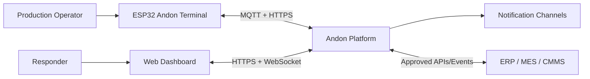
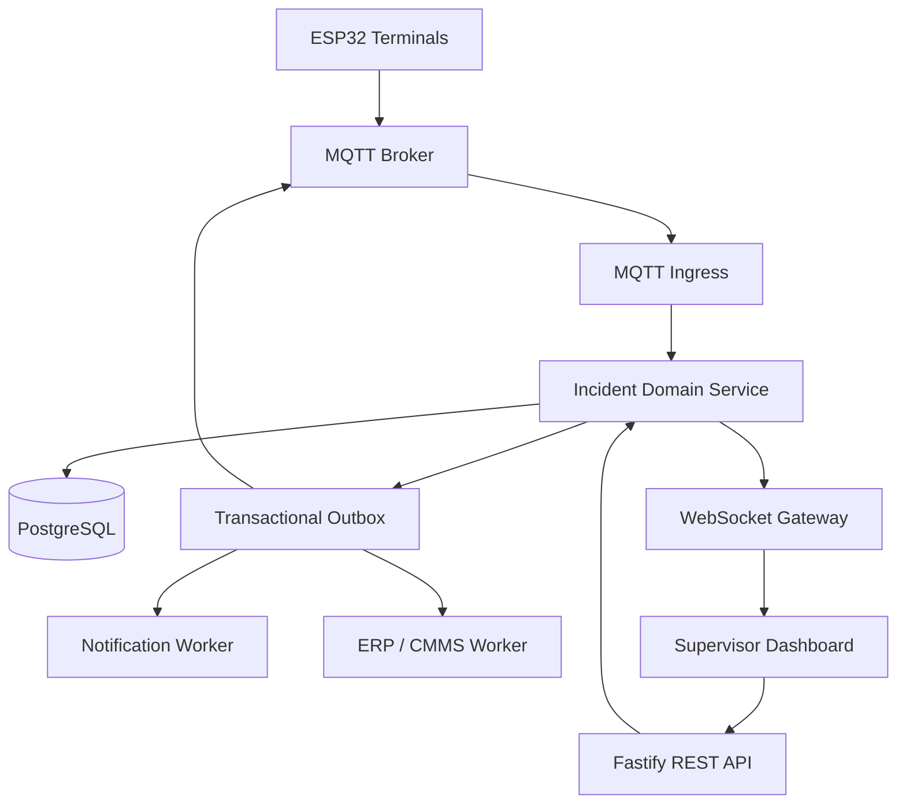
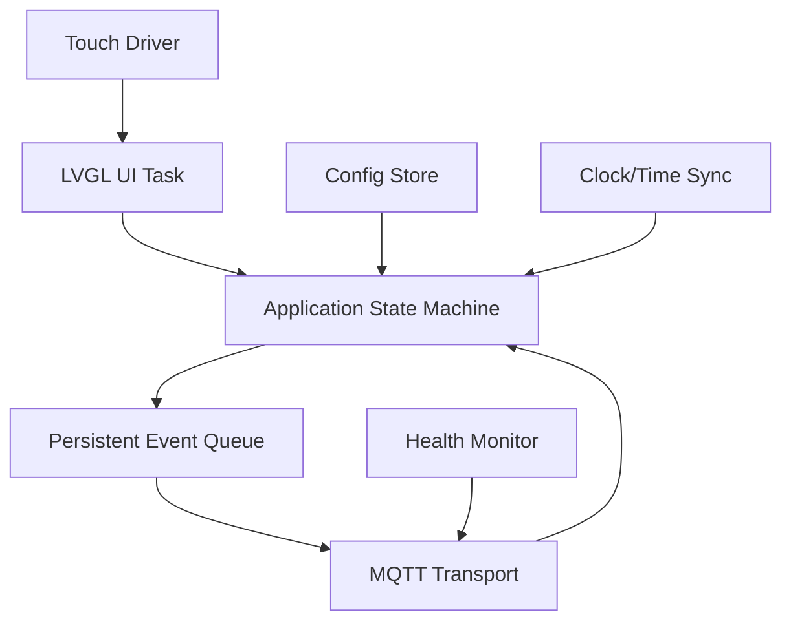
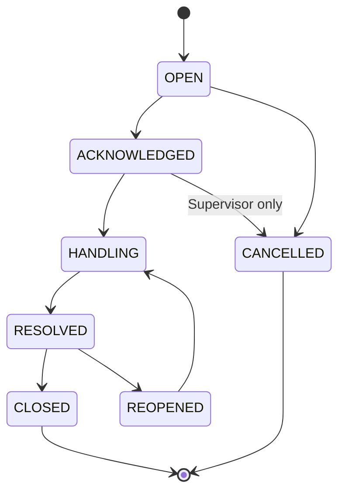
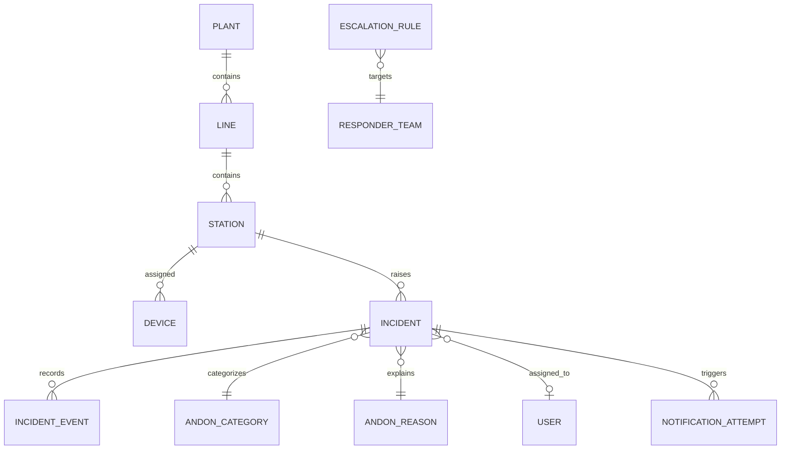
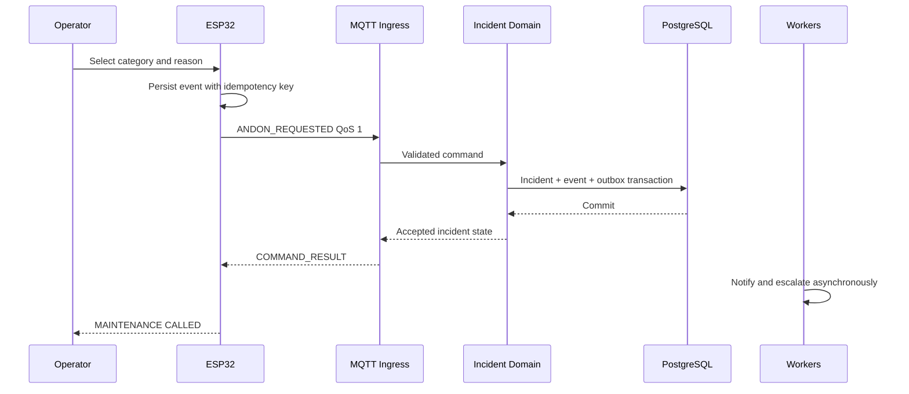

# Technical Architecture — Digital Andon System

| Field | Value |
|---|---|
| Architecture style | Event-driven edge terminal with modular backend |
| Device | ESP32 + 480×320 capacitive touchscreen |
| Firmware | Arduino framework, PlatformIO, LVGL 8.4, MQTT client |
| Backend | Node.js 20+ with Fastify and MQTT.js |
| Data | PostgreSQL 16+; Redis optional for ephemeral presence/cache |
| Dashboard | Responsive web application with WebSocket/SSE live updates |
| Updated | 2026-08-11 |

> Filename intentionally follows the requested `architectur.md`. Rename it to `architecture.md` later only if the repository convention requires it, and update all cross-references atomically.

## 1. Architecture objectives

- Provide fast and deterministic interaction on a constrained ESP32 terminal.
- Preserve requests during temporary device, network, broker, or backend interruption.
- Guarantee one logical incident for repeated delivery attempts.
- Keep incident-state authority in one backend domain service.
- Support real-time terminal and dashboard updates.
- Isolate the terminal from ERP, database, and notification credentials.
- Start as a modular monolith for the pilot while preserving clear extraction boundaries.
- Maintain an auditable incident timeline.

## 2. System context



The ESP32 is never permitted to connect directly to PostgreSQL, ERP databases, or enterprise credentials.

## 3. Container architecture



For the MVP, `MQTT Ingress`, `REST API`, `Incident Domain Service`, `WebSocket Gateway`, and workers may run in one Node.js deployment with separate modules and processes where needed. Do not split them into microservices before operational load justifies the cost.

## 4. Responsibility boundaries

| Component | Responsibilities | Must not do |
|---|---|---|
| ESP32 firmware | Touch UI, cached configuration, local state display, persistent outbound queue, heartbeat | Calculate official KPIs, store ERP credentials, decide authoritative incident transitions |
| MQTT broker | Authenticated pub/sub transport, ACL enforcement, session delivery | Contain business logic or become the source of truth |
| MQTT ingress | Validate envelope, authenticate device context, deduplicate, call domain service | Write incident tables through ad-hoc SQL |
| Incident domain | Enforce state machine, business rules, permissions, timestamps | Depend on notification delivery for success |
| REST API | Dashboard/admin endpoints, schema validation, authorization | Duplicate domain transition logic |
| PostgreSQL | Durable incidents, events, config, outbox, audit | Accept direct terminal connections |
| Notification worker | Deliver and retry notifications/escalations | Mutate incident state based only on delivery status |
| Integration worker | Exchange ERP/MES/CMMS context | Block request creation when an external system is unavailable |
| Web dashboard | Active board, responder actions, admin, reports | Become authoritative for incident state |

## 5. Device architecture

### 5.1 Firmware modules



### 5.2 Recommended tasks

| Task | Responsibility | Notes |
|---|---|---|
| UI task | LVGL tick, input, rendering, screen events | Only this task mutates LVGL objects |
| Network task | Wi-Fi lifecycle, TLS, MQTT reconnect | Uses bounded backoff |
| App/event task | State transitions and command routing | Converts transport events into UI events |
| Persistence task | Queue/config writes | Batch writes to limit flash wear |
| Health task | Heartbeat, memory, reset reason | Low frequency |

Actual task separation should be validated against the selected ESP32 variant and memory. Avoid unnecessary tasks and large stacks.

### 5.3 Device persistence

Persist only:

- Provisioning identity and non-exportable credential reference.
- Last valid configuration plus version/hash.
- Current accepted incident summary.
- Pending outbound event queue.
- Last server time offset and diagnostic counters.

Do not persist notification recipient data, ERP tokens, or unrestricted personal data.

### 5.4 Boot sequence

1. Initialize display, touch, storage, and LVGL.
2. Load provisioning and last valid configuration.
3. Restore queued request and active incident summary.
4. Render the safe cached state.
5. Connect Wi-Fi, synchronize time, then connect MQTT.
6. Publish heartbeat and request state reconciliation.
7. Apply authoritative backend state and configuration.

If the backend cannot be reached, the device remains explicit about offline state and does not invent a synchronized `LINE RUNNING` status.

## 6. Backend architecture

### 6.1 Recommended modules

- `identity`: users, roles, service accounts, device authentication.
- `plant-model`: plants, lines, stations, machines, shifts.
- `configuration`: categories, reasons, resolutions, UI config, versioning.
- `incidents`: aggregate, transitions, assignment, cancellation, reopen.
- `escalation`: rules, SLA schedules, escalation evaluation.
- `notifications`: channel adapters, delivery attempts, retry.
- `realtime`: WebSocket/SSE subscriptions and MQTT outbound projection.
- `reporting`: KPI queries and exports.
- `integrations`: ERP/MES/CMMS adapters.
- `audit`: immutable event timeline and administrative audit.
- `device-management`: provisioning, status, heartbeat, firmware/config rollout metadata.

### 6.2 Transaction boundary

A state-changing command must, in one PostgreSQL transaction:

1. Lock or version-check the incident aggregate.
2. Validate actor, permission, and transition.
3. Update the current incident record.
4. Append an incident event.
5. Add required outbound messages to the outbox.
6. Commit.

Workers publish outbox records after commit and mark them delivered. This prevents database state from being committed without the corresponding real-time event.

## 7. Incident domain model

### 7.1 Aggregate

The Incident aggregate owns:

- Identity and idempotency key.
- Station/category/reason snapshots.
- Current state and optimistic version.
- Assigned responder/team.
- Relevant timestamps.
- Resolution and close confirmation.
- Reopen count and cancellation data.

### 7.2 State transitions



The domain rejects invalid transitions with a machine-readable error such as `INVALID_INCIDENT_TRANSITION`.

## 8. MQTT design

### 8.1 Topic convention

Use versioned topics and derive authorization from authenticated device identity.

| Direction | Topic |
|---|---|
| Device heartbeat | `andon/v1/plant/{plantId}/station/{stationId}/device/{deviceId}/heartbeat` |
| Device event | `andon/v1/plant/{plantId}/station/{stationId}/device/{deviceId}/event` |
| Device acknowledgement/result | `andon/v1/device/{deviceId}/result` |
| Device command/state | `andon/v1/device/{deviceId}/command` |
| Device configuration | `andon/v1/device/{deviceId}/config` |
| Plant active-board projection | `andon/v1/plant/{plantId}/active` |

Do not place secrets, operator names, or reason text in topic paths.

**Ad-hoc extension (2026-08-12, not originally specced here):** `eventType: "PRODUCTION_COUNT_UPDATED"` is also published on the Device event topic, for the operator-facing production-count screen (`firmware/src/main.cpp`'s `showScreenUpdateProduction()`/`onProductionConfirm()` - already flagged in that file as scope beyond design.md's numbered screens). Payload: `{ "productionCount": <int>, "rejectCount": <int>, "workOrderId": "<string>" }` (`rejectCount` added 2026-08-13, optional on the wire for backward compat with older firmware - see `backend/src/server.ts`'s handler, defaults to 0 if absent - for OEE Quality tracking, see `dashboard/PLAN.md`'s matching note). Reuses the existing envelope/topic/idempotency convention rather than a new topic; acked via the same COMMAND_RESULT shape on the result topic (no `incidentId` - not an incident, no state-machine lifecycle applies). Implemented in `firmware/src/andon_mqtt.cpp` (`AndonMqtt::submitProductionUpdate()`) and `backend/src/server.ts`'s test backend. Revisit (proper contract doc under `contracts/`, real persistence) before this leaves test-backend scope.

**Further ad-hoc extension (2026-08-13):** the device now also fires `PRODUCTION_COUNT_UPDATED` once automatically at boot (`main.cpp`'s `setup()`, after `AndonWorkOrders::sync()`), not only on an operator's explicit `CONFIRM` tap - so the dashboard's production tile reflects this terminal's count immediately after a reboot/power-cycle instead of going stale until the next manual update. Same payload shape, same best-effort/no-retry semantics as every other boot-time sync step in `setup()`.

**Also new (2026-08-13):** `GET /api/v1/work-orders/stations/{stationId}` (HTTP, same pattern as the station-configuration endpoint above, not MQTT) returns `{ "workOrders": [{ "workOrderId", "product", "target", "productionCount" }, ...] }` for that station. Backs the device's new WORK ORDER picker (`main.cpp`'s `SCR_WORK_ORDER_LIST`, reached from SCR-01's UPDATE PRODUCTION button) so `workOrderId` in the payload above is a real operator selection instead of a hardcoded literal. `workOrderId`/`product`/`target` are in-memory seed data only (`backend/src/work-order-store.ts`) - no real ERP/MES integration; `productionCount` is live, joined in at request time from the same per-(station,workOrder) state `PRODUCTION_COUNT_UPDATED` writes to (`production-store.ts`'s `getProductionCount()`) - added same day as a bugfix so the picker always shows the server's own number, not a device-local one that could drift (see `firmware/PLAN.md`'s matching entry). Same "revisit before this leaves test-backend scope" caveat as the extension above; no `contracts/` doc yet either.

**Also new, same day:** `GET /api/v1/work-orders` (no `stationId` - every station's work orders, same `productionCount` enrichment). Fixes a device/dashboard inconsistency: the dashboard's PRODUCTION panel only ever showed work orders that had already reported a count, so a freshly-seeded one the device's picker already listed (with `productionCount: 0`) wasn't on the dashboard yet ("list di hardware dengan list di dashboard beda") - see `dashboard/PLAN.md`'s matching note.

### 8.2 Event envelope

```json
{
  "schemaVersion": 1,
  "eventId": "01J5...ULID",
  "eventType": "ANDON_REQUESTED",
  "idempotencyKey": "dev-esp32-042:1710000000:17",
  "deviceId": "esp32-042",
  "stationId": "PIPE-LINE-02",
  "deviceTimestamp": "2026-08-11T18:25:00+07:00",
  "sequence": 17,
  "correlationId": "01J5...ULID",
  "payload": {
    "categoryCode": "MAINTENANCE",
    "reasonCode": "CUTTING_MACHINE_JAM",
    "workOrderId": "WO-240811-07"
  }
}
```

### 8.3 Delivery semantics

- MQTT QoS 1 for device events and commands.
- At-least-once delivery; duplicates are expected.
- `idempotencyKey` has a unique database constraint scoped appropriately.
- Results refer to `eventId` and `correlationId`.
- Retained messages are allowed for current device configuration/state projections, not for raw incident commands unless carefully designed.
- Device `Last Will` publishes offline presence; backend heartbeat timeout remains the authoritative health rule.

### 8.4 Device result example

```json
{
  "schemaVersion": 1,
  "eventId": "01J5...result",
  "eventType": "COMMAND_RESULT",
  "correlationId": "01J5...ULID",
  "status": "ACCEPTED",
  "incidentId": "01J5...incident",
  "serverTimestamp": "2026-08-11T11:25:01Z",
  "incidentStatus": "OPEN",
  "version": 1
}
```

## 9. REST API

Base path: `/api/v1`

| Method | Endpoint | Purpose |
|---|---|---|
| `GET` | `/stations/{stationId}/active-incident` | Reconcile terminal/current state |
| `GET` | `/incidents` | Filtered history and active board |
| `GET` | `/incidents/{incidentId}` | Detail and audit timeline |
| `POST` | `/incidents/{incidentId}/acknowledge` | Accept ownership |
| `POST` | `/incidents/{incidentId}/start-handling` | Mark active handling |
| `POST` | `/incidents/{incidentId}/resolve` | Submit resolution |
| `POST` | `/incidents/{incidentId}/confirm-close` | Operator/supervisor close |
| `POST` | `/incidents/{incidentId}/reopen` | Report unresolved condition |
| `POST` | `/incidents/{incidentId}/cancel` | Policy-controlled cancellation |
| `GET` | `/configuration/stations/{stationId}` | Device/dashboard configuration |
| `GET` | `/reports/kpis` | Aggregated KPI report |
| `GET` | `/devices` | Fleet health and heartbeat |

Requirements:

- JSON Schema validation for request and response payloads.
- Bearer authentication for users/services; device flow uses device credentials.
- Idempotency header for mutation retries where applicable.
- Cursor pagination for history.
- RFC 3339 timestamps in UTC.
- Stable error codes independent of human-readable messages.

## 10. Data model



### 10.1 Core tables

| Table | Purpose | Important constraints |
|---|---|---|
| `plants`, `lines`, `stations`, `devices` | Plant hierarchy and provisioning | Unique business codes |
| `andon_categories`, `andon_reasons` | Configurable taxonomy | Versioned/soft-deactivated |
| `incidents` | Current aggregate state | Unique idempotency key, optimistic version |
| `incident_events` | Immutable transition timeline | Append-only application role |
| `responder_teams`, `team_members` | Routing and ownership | Effective date/shift scope |
| `escalation_rules` | SLA and escalation policy | Priority and scope constraints |
| `notification_attempts` | Delivery audit/retry | Provider message reference |
| `device_heartbeats` or latest health projection | Device health | Time-partition/retention as needed |
| `outbox_messages` | Reliable event publication | Unique message id and delivery state |
| `integration_references` | ERP/CMMS references | External system + external id uniqueness |

### 10.2 Database controls

- Use migrations; never edit production schema manually.
- Store current incident state and append-only events in the same transaction.
- Add optimistic `version` to incidents.
- Use partial unique indexes for active-incident policies where practical.
- Store category/reason label snapshots with historical incidents.
- Partition or archive high-volume heartbeat and notification logs based on measured volume.

## 11. Key sequence — request creation



## 12. Offline and reconciliation strategy

### 12.1 Device outbound queue

- Bounded persistent ring queue sized for incident commands, not telemetry history.
- Each entry includes event id, idempotency key, sequence, payload, retry count, and creation time.
- Remove only after backend `ACCEPTED`, `DUPLICATE_EXISTING`, or a terminal validation response that the UI handles explicitly.
- Retry using jittered exponential backoff with a maximum interval.
- Surface queue-full as a terminal fault; never silently discard a user request.

### 12.2 Reconciliation

On reconnect or restart:

1. Reconnect MQTT.
2. Publish heartbeat with last known incident id/version and queue depth.
3. Request current station state.
4. Replay pending events in sequence.
5. Apply backend results idempotently.
6. Render the highest-authority current state.

Conflict policy: backend incident state wins, but unresolved local commands remain visible until explicitly reconciled.

## 13. Security architecture

### 13.1 Device identity

- Provision unique credentials per device.
- Prefer mutual TLS certificates if broker and operational processes support rotation; otherwise use per-device strong credentials over TLS.
- MQTT ACL permits a device to publish only its own event/heartbeat topics and subscribe only to its own command/config topics.
- Disable insecure provisioning interfaces after commissioning.

### 13.2 User and service access

- OIDC/SSO for dashboard users where available.
- RBAC plus plant/line scope.
- Short-lived access tokens.
- Separate service accounts for ERP/CMMS integrations.
- Audit all admin and transition operations.

### 13.3 Application controls

- Strict payload size and schema limits.
- Rate limiting by device, account, and endpoint.
- Parameterized queries through a query builder/ORM or reviewed SQL repository.
- Secret management outside images and source control.
- Dependency scanning, firmware signing where supported, and controlled releases.
- Minimize displayed personal information.

## 14. Notification and escalation architecture

The domain emits events such as:

- `IncidentOpened`
- `IncidentAcknowledged`
- `IncidentHandlingStarted`
- `IncidentResolved`
- `IncidentClosed`
- `IncidentReopened`
- `IncidentSlaBreached`

The notification worker maps events and policy to delivery adapters. Dashboard and MQTT are primary channels; email, chat, or SMS adapters may be added without changing the incident aggregate.

Escalation evaluation should use durable scheduled jobs or a queue with delayed delivery. A periodic reconciliation job must catch missed schedules after restarts.

## 15. ERP/MES/CMMS integration

### 15.1 ERP/MES inbound context

- Work order, product, target quantity, shift, and machine context are optional enrichments.
- Cache enough context in the backend to avoid blocking Andon operation.
- Terminal receives only required display fields.

### 15.2 Outbound events

- Closed incidents may be posted as production downtime transactions.
- Maintenance incidents may create or update CMMS work requests based on policy.
- Quality incidents may open a quality-hold reference.
- External reference is stored in `integration_references`.

Use an anti-corruption adapter so external schemas do not leak into core incident models.

## 16. Deployment topology

### 16.1 Pilot

- Docker Compose on one controlled server/VM.
- Services: reverse proxy, API/worker, dashboard, MQTT broker, PostgreSQL, optional Redis, monitoring agent.
- TLS termination at reverse proxy and MQTT TLS listener.
- Automated database backups to a separate target.

### 16.2 Production evolution

- Run stateless API/worker replicas behind a load balancer.
- Use managed or high-availability PostgreSQL according to business criticality.
- Cluster MQTT only when measured scale or availability requires it.
- Separate worker concurrency by notification/integration channel.
- Deploy per-site edge relay only where WAN reliability requires local autonomy.

## 17. Observability

### 17.1 Metrics

- Connected devices and heartbeat age.
- MQTT message rate, validation failures, duplicate rate, and consumer latency.
- API request latency and error rate.
- Incident counts by state and age.
- Outbox backlog and oldest undelivered age.
- Notification success/failure and escalation delay.
- Database connections, transaction latency, locks, storage, and backup status.
- Firmware free heap, reset reason, reconnects, queue depth, and UI loop health.

### 17.2 Logs and traces

- Structured JSON logs on backend.
- Include `correlationId`, `incidentId`, `deviceId`, and `stationId` where applicable.
- Redact credentials and unnecessary personal data.
- Distributed tracing is optional for the modular monolith but correlation identifiers are mandatory.

### 17.3 Alerts

- Device fleet offline percentage exceeds threshold.
- Outbox backlog or notification failures grow.
- Unacknowledged incidents exceed SLA.
- Database backup fails.
- MQTT broker disconnect or authentication failures spike.
- Firmware crash loop or queue-full event detected.

## 18. Failure modes

| Failure | Expected behavior |
|---|---|
| Wi-Fi unavailable | Terminal queues request, displays offline status, retries |
| MQTT broker unavailable | REST/dashboard may continue; device queue persists |
| API process unavailable | Broker ingestion pauses/retries; no silent data loss |
| PostgreSQL unavailable | Request not accepted; device keeps queued command |
| Notification provider unavailable | Incident accepted; notification retry continues |
| ERP/CMMS unavailable | Incident workflow continues; integration outbox retries |
| Device reboots | Restores queue and last incident, then reconciles |
| Duplicate MQTT delivery | Unique idempotency constraint returns existing result |
| Out-of-order state event | Version check rejects stale update and sends current state |
| Device clock incorrect | Backend timestamps remain authoritative |

## 19. Testing strategy

### Firmware

- Unit-test application state reducer and serialization outside hardware where practical.
- Hardware-in-loop tests for touch, display, Wi-Fi recovery, MQTT, flash queue, and power cycling.
- Long-duration soak test with reconnect and memory monitoring.
- Validate actual capacitive touch with production gloves.

### Backend

- Unit tests for every allowed and prohibited incident transition.
- Contract tests for MQTT and REST schemas.
- Integration tests with PostgreSQL and broker containers.
- Idempotency, concurrency, and outbox failure tests.
- Authorization tests for every transition endpoint.
- Load test active-board fan-out and device heartbeats.

### End-to-end

- Request → acknowledge → handling → resolve → operator close.
- Offline request and restart recovery.
- Duplicate and out-of-order delivery.
- SLA escalation and notification failure.
- Dashboard/device convergence after reconnect.

## 20. Repository layout

```text
andon-system/
├── firmware/
│   ├── include/
│   ├── src/
│   ├── test/
│   └── platformio.ini
├── backend/
│   ├── src/modules/
│   ├── src/infrastructure/
│   ├── migrations/
│   └── test/
├── dashboard/
│   ├── src/
│   └── test/
├── contracts/
│   ├── mqtt/
│   └── http/
├── deploy/
│   ├── compose/
│   └── monitoring/
├── docs/
│   └── adr/
├── PRD.md
├── design.md
├── architectur.md
└── agents.md
```

## 21. Architecture decisions

| Decision | Choice | Rationale |
|---|---|---|
| Device transport | MQTT QoS 1 + HTTPS reconciliation | Efficient real time plus explicit state recovery |
| Delivery semantics | At least once + idempotency | Practical with MQTT and intermittent networks |
| Backend style | Modular monolith first | Faster pilot and simpler operations |
| Source of truth | PostgreSQL-backed incident domain | Strong transitions and auditability |
| Event publishing | Transactional outbox | Avoid state/event inconsistency |
| UI ownership | Backend state authoritative; device cached | Prevent conflicting incident workflows |
| Safety | No machine safety control | System is not safety rated |

## 22. Related documents

- [Product requirements](PRD.md)
- [HMI design](design.md)
- [Coding-agent instructions](agents.md)

