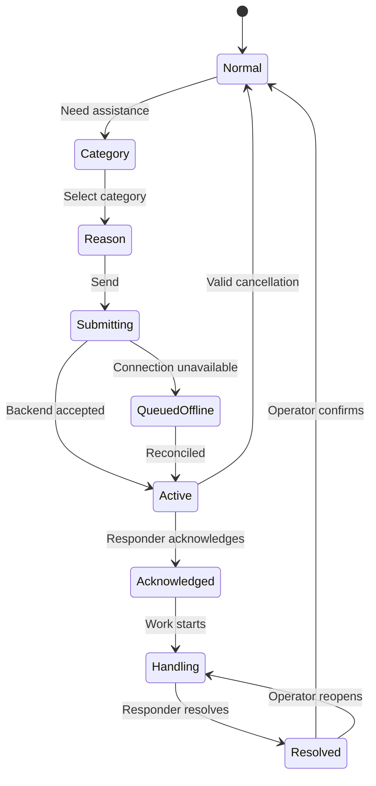

# HMI/UI Design Specification — Digital Andon Terminal

| Field | Value |
|---|---|
| Display | 3.5-inch capacitive touchscreen |
| Resolution | 480×320 landscape |
| UI framework | LVGL 8.4 recommended for the first implementation |
| Input | Touch; optional external physical call/cancel button |
| Theme | High-contrast industrial dark HMI |
| Related scope | [PRD.md](PRD.md) |

## 1. Design objective

The interface must let a pipe-production operator request assistance quickly, understand the current response state from a distance, and safely confirm production readiness. It should feel like a professional machine HMI while remaining realistic for ESP32 memory, rendering, and touch constraints.

The device is an Andon interaction terminal, not a general dashboard. Each screen should present one decision and one dominant status.

## 2. Design principles

1. **One screen, one job.** Do not combine request creation, incident handling, history, settings, and analytics.
2. **Three-tap request.** `Need Assistance → Category → Reason/Send` is the normal path.
3. **Status over decoration.** Current line and incident state must dominate the screen.
4. **No typing by default.** Use configured categories, reasons, resolution codes, and short preset notes.
5. **Color plus text plus icon.** Never use color as the only status signal.
6. **Operator confirms recovery.** A technician resolving an issue does not automatically show `LINE RUNNING`.
7. **Honest connectivity.** `QUEUED OFFLINE` and `REQUEST ACCEPTED` are visually different.
8. **Resource discipline.** Prefer flat fills, small icon sets, and static layout over animations and expensive effects.

## 3. Physical and environmental constraints

- Screen may be viewed under strong factory lighting.
- Operator may wear gloves or have dirty hands.
- Touch accuracy is lower than on a mobile phone.
- The terminal may be mounted at chest or eye level.
- Operators may need to read the primary state from approximately two meters.
- Noise may make sound notifications ineffective; visual feedback must be sufficient.
- Power or network may be interrupted at any time.

## 4. Layout system

### 4.1 Screen regions

| Region | Height | Purpose |
|---|---:|---|
| Global header | 40 px | Station, shift, Wi-Fi, MQTT, time |
| Status/section header | 56–72 px | Dominant state or screen title |
| Main content | 152–184 px | Metrics, reason tiles, responder, or timer |
| Primary actions | 64–80 px | One or two large actions |

The exact height can vary by screen, but the 40 px global header remains stable to reduce visual movement.

### 4.2 Spacing

| Token | Value | Usage |
|---|---:|---|
| `space-1` | 4 px | Icon-to-label internal spacing |
| `space-2` | 8 px | Compact content spacing |
| `space-3` | 12 px | Standard card gap |
| `space-4` | 16 px | Screen margin and section separation |
| `radius-card` | 8–10 px | Cards and buttons |
| `border` | 1 px | Neutral card border |

### 4.3 Touch targets

- Absolute minimum: 48×48 px.
- Primary action: at least 64 px high.
- Category tiles: approximately 218×88 px in a 2×2 grid.
- Reason tiles: approximately 136×82 px in a 3×2 grid.
- Leave at least 8 px between unrelated touch targets.
- Avoid icon-only actions except universally understood connectivity indicators.

## 5. Visual tokens

### 5.1 Color palette

| Token | Hex | Usage |
|---|---|---|
| `bg-base` | `#07131C` | Screen background |
| `bg-panel` | `#10212C` | Cards and panels |
| `bg-raised` | `#162A36` | Selected/raised panels |
| `border-neutral` | `#3E535F` | Card outline |
| `text-primary` | `#F4F7FA` | Main text |
| `text-secondary` | `#AFC0C9` | Labels and metadata |
| `info` | `#00A8F3` | Neutral information and focus |
| `running` | `#35C759` | Normal/running/resolved |
| `waiting` | `#F2A914` | Acknowledged/on the way |
| `fault` | `#EF3E3E` | Active incident/maintenance |
| `quality` | `#7B4BC4` | Quality category |
| `material` | `#1976D2` | Material category |
| `disabled` | `#52636C` | Disabled controls |

Use solid fills. Avoid gradients because they consume visual attention and make status colors less deterministic.

### 5.2 Typography

Use a compact sans-serif font with numerals that remain distinguishable at a distance. Recommended LVGL font sizes:

| Style | Size | Usage |
|---|---:|---|
| `display` | 48–56 px | Elapsed timer, production count |
| `status` | 28–32 px | `LINE RUNNING`, `ISSUE RESOLVED` |
| `title` | 22–24 px | Screen/category title |
| `button` | 20–22 px | Primary actions |
| `body` | 18 px | Reason labels and values |
| `caption` | 14–16 px | Header and supporting metadata |

Prefer uppercase for short state labels, not for paragraphs.

### 5.3 Icons

- Use one consistent monochrome outline icon set converted to LVGL-compatible symbols or small indexed assets.
- Required icons: running/check, hand/help, maintenance/tool, quality/search/shield, material/box, supervisor/person, Wi-Fi, MQTT/link, clock, bell, cancel, note, technician, reopen, and play.
- Every actionable icon must have a text label.
- Limit icon assets and reuse them to control flash and RAM usage.

## 6. Global header

All primary screens show:

- Left: `PIPE LINE 02` or assigned station label.
- Center-left: `SHIFT A`.
- Right: Wi-Fi icon, `MQTT` plus green/amber/red dot, and local time.

Connectivity semantics:

| Indicator | Meaning |
|---|---|
| Green dot | Broker connected and heartbeat healthy |
| Amber dot | Wi-Fi available; broker reconnecting or sync pending |
| Red dot | Offline; local cache only |

**Current implementation (2026-08-12):** no MQTT broker exists yet (see `agents.md`'s repository ownership table - `backend/` hasn't been created), so the dot/Wi-Fi icon can only reflect what's actually measurable right now: raw `WiFi.status()` (green = connected, red = not) via `main.cpp`'s `updateHeaderConnDot()`, refreshed every second by the 1Hz tick timer. The amber ("Wi-Fi up, broker down") tier described above needs a real broker connection to distinguish from green and isn't implemented - revisit once MQTT exists. Local time is now NTP-synced (`andon_wifi.cpp`'s `configTime()` call on connect, GMT+7 default) instead of a fixed placeholder; shows `--:--` until the first successful sync.

The header is informational and not normally interactive (aside from the long-press dev gesture - see `agents.md`-deviation note in `firmware/src/main.cpp`'s `headerLongPressCb()` - which only toggles the separate LINE RUNNING/OFFLINE mock banner state, not these connectivity indicators).

## 7. Screen specifications

### SCR-01 — Normal status

**Purpose:** Confirm that the station has no blocking incident and provide minimal production context.

Content:

- Green banner: `LINE RUNNING`.
- Work order: `WO-240811-07`.
- Production: `72 / 120`.
- Rate: `18 pcs/h`.
- Bottom row: three equal-width icon-only buttons - update production (`+` icon, green), primary action `NEED ASSISTANCE` (bell icon), config (gear icon).

Rules:

- `LINE RUNNING` is shown only when no blocking incident exists and the last known backend/device state permits it.
- When offline, show an amber `OFFLINE — LOCAL MODE` banner instead of asserting a synchronized running state.
- ~~The primary action occupies the full lower width.~~ **Superseded 2026-08-12** (explicit user instruction, `agents.md` §2 precedence rules): the lower row is a 3-way equal split between update-production, `NEED ASSISTANCE`, and config, all icon-only for equal visual weight. `NEED ASSISTANCE` stays the only color-coded (amber) button of the three so it still reads as the primary action; the other two use neutral/muted colors so they don't compete with it (`agents.md` §9 UI rule: "keep one dominant decision per screen"). **Partially superseded again, 2026-08-13** (explicit user instruction): update-production switched from a blue pencil (`LV_SYMBOL_EDIT`) to a green `+` (`LV_SYMBOL_PLUS`, `COLOR_RUNNING`), the same green as the `LINE RUNNING` banner, tying it to that state rather than reading as a generic "edit" affordance. This does mean two of the three buttons are now color-coded, not just `NEED ASSISTANCE` - `NEED ASSISTANCE`'s amber is still visually distinct enough (warm vs. the banner/update-production's green) that it still reads as the one action calling for attention, but flagging the "only one is color-coded" rule above as no longer literally true.
- Config (gear) opens WiFi setup (scan/select/type-password on a T9 keypad, NVS-saved network), ported from `examples/gemini-chatbot`'s on-device WiFi manager as-is (same keypad, same visual style - explicit user instruction) - see `firmware/include/andon_wifi.hpp`/`andon_wifi.cpp`. **Freely reachable from the operator flow** (explicit user instruction) - a second, larger deviation from this screen's original "hidden admin gesture/physical provisioning, not the operator flow" plan (see the changelog note above this table). `secrets.h`'s `WIFI_SSID`/`WIFI_PASSWORD` remain a fallback seed, not the only path, now that the on-screen flow exists.
- **`WO-240811-07` above was a static placeholder until 2026-08-13** - the Work order/Production/Rate card itself stays non-clickable, but the update-production (edit) icon now opens a new picker screen first (**SCR_WORK_ORDER_LIST**, not one of this doc's originally numbered screens, same "new scope beyond the numbered flow" status as the production-count screen it leads into): a list of this station's work orders (`GET /api/v1/work-orders/stations/{stationId}`, fetched/cached/placeholder-fallback the same way SCR-02/03's reasons are - see `firmware/src/andon_workorders.cpp`). Rows aren't directly tappable - an Up/Down cursor plus a Select button (right-hand column, mirrors `andon_wifi.cpp`'s network list) picks one, then the flow proceeds into the production counter for that work order; only 3 rows show at once (`WORK_ORDER_LIST_VISIBLE_ROWS`), Up/Down scrolls the window for stations with more than that. The selection persists (NVS) across reboots and is what SCR-01's Work order/Production fields, and every `ANDON_REQUESTED`/`PRODUCTION_COUNT_UPDATED` MQTT payload's `workOrderId`, now actually reflect - see `architectur.md` §8.1's matching note.

### SCR-02 — Category selection

**Purpose:** Select the responsible team.

Content:

- Title: `CALL ANDON`.
- 2×2 tiles: `MAINTENANCE`, `QUALITY`, `MATERIAL`, `SUPERVISOR`.
- Secondary action: `CANCEL`.

Rules:

- Tile color represents category, not current incident severity.
- Tapping a category opens its reason screen; it does not immediately submit.
- Preserve the last selection only during the current flow.

### SCR-03 — Reason selection

**Purpose:** Categorize the request with minimal effort.

Example Maintenance reasons:

- Machine jam
- Cutting fault
- Welding fault
- Sensor fault
- Utility
- Other

Actions:

- `BACK`
- `SEND REQUEST`

Rules:

- `SEND REQUEST` is disabled until one reason is selected.
- Selected tile receives a 2 px category-colored border and check indicator.
- `Other` opens preset secondary reasons in the MVP; it does not open a full keyboard.
- If a request with the same station/category is already active, show the existing incident instead of sending another request.

### SCR-04 — Request active

**Purpose:** Show that the backend accepted the request and that response timing is active.

Content:

- Red banner: `MAINTENANCE CALLED` or corresponding category.
- Large elapsed timer.
- Issue and current state `OPEN`.
- Actions: `CANCEL REQUEST`, `ADD NOTE`.

Rules:

- Red top status strip may pulse slowly, no faster than once per second.
- Timer uses backend open time after acceptance; the device may interpolate locally between sync updates.
- Cancellation requires a confirmation dialog and configured reason.
- `ADD NOTE` presents preset notes such as `Machine stopped`, `Production can continue slowly`, or `Safety risk — follow site procedure`.

### SCR-04B — Queued offline

**Purpose:** Prevent the operator from believing that a responder has been notified when the event exists only locally.

Content:

- Amber banner: `QUEUED OFFLINE`.
- Reason summary and local elapsed time.
- Text: `Request will be sent when connection returns`.
- Actions: `CANCEL LOCAL REQUEST`, `RETRY NOW`.

Rules:

- Do not use `MAINTENANCE CALLED` until backend acknowledgement is received.
- Keep the local idempotency key across retries and restart.

### SCR-05 — Acknowledged / responder on the way

**Purpose:** Reassure the operator and show accountability.

Content:

- Amber banner: `TECHNICIAN ON THE WAY`.
- Responder: `BUDI • MT-04`.
- Stepper: `OPEN ✓ → ACK ✓ → HANDLING …`.
- Metrics: response time and current wait time.
- Optional action: `UPDATE STATUS` or `ADD NOTE`.

Rules:

- Display only approved short responder name/identifier.
- If ownership changes, update the card and add an audit event without resetting incident time.
- When handling begins, banner becomes `ISSUE BEING HANDLED` while remaining amber.

### SCR-06 — Resolved confirmation

**Purpose:** Separate responder resolution from operator confirmation.

Content:

- Green banner: `ISSUE RESOLVED`.
- Downtime, handled-by, and resolution summary.
- Question: `MACHINE READY TO RUN?`
- Actions: `REOPEN`, `CONFIRM & RUN`.

Rules:

- `CONFIRM & RUN` uses a confirmation dialog or 1.5-second hold gesture.
- `REOPEN` changes the incident to `REOPENED`, returns to an active-incident screen, and requires a preset reason; the responder then resumes `HANDLING`.
- After successful close, show a two-second success state, then return to SCR-01.

## 8. Dialogs and transient states

### 8.1 Send confirmation

- Category and reason summary.
- `CANCEL` and category-colored `SEND` buttons.
- Optional skip may be enabled only after usability testing proves accidental calls remain acceptably low.

### 8.2 Cancel confirmation

- Message: `Cancel this request?`
- Preset reasons: accidental call, duplicate, issue cleared, wrong category.
- Acknowledged incidents require supervisor permission to cancel.

### 8.3 Reconnect state

- Non-blocking amber strip below the header.
- Do not cover active timer or primary actions.
- Show `SYNCED` briefly after queued data is accepted.

### 8.4 Error state

- Plain-language problem and one recovery action.
- Preserve incident context and idempotency key.
- Never expose stack traces, broker addresses, tokens, or raw API responses.

## 9. Interaction state machine

## 10. Component inventory

| Component | LVGL mapping | Notes |
|---|---|---|
| App shell | `lv_obj` | Fixed 480×320 root |
| Global header | `lv_obj` + `lv_label` | Reused across screens |
| Status banner | Styled `lv_obj` | Solid color and icon |
| Category tile | `lv_btn` | Category style variant |
| Reason tile | `lv_btn` with checked state | 3×2 grid |
| Primary button | `lv_btn` | 64–80 px high |
| Timer | `lv_label` | Update once per second |
| Progress stepper | `lv_obj` + labels/icons | No continuous animation |
| Confirmation dialog | `lv_msgbox` or custom modal | Large two-action layout |
| Connectivity badge | `lv_label`/icon | Updated by event, not polling UI |
| Toast | Custom transient `lv_obj` | Success/error, auto-dismiss where safe |

## 11. LVGL implementation guidance

- Use one persistent app shell and replace only the content container.
- Centralize styles; do not create duplicate style objects per screen transition.
- Load only required fonts and glyph ranges.
- Prefer vector-like LVGL symbols or small indexed PNG assets.
- Avoid large full-screen image backgrounds.
- Update the timer once per second; do not redraw the entire screen.
- Dispatch backend/device events to a UI event queue; do not mutate LVGL objects from non-UI tasks.
- Keep a deterministic screen model derived from the incident state.
- Store selected category/reason as flow state, not global configuration.
- Provide a hidden admin gesture or physical provisioning process; do not put settings in the operator flow.

## 12. Feedback and motion

- Touch press: immediate color/value change under 100 ms.
- Request sending: short spinner or progress indicator, maximum visible wait before showing offline/error state.
- Active red strip: optional slow pulse; respect CPU and distraction limits.
- Success: green check for approximately two seconds.
- No decorative transitions longer than 200 ms.
- Optional buzzer patterns must be configurable and must not imitate emergency alarms.

## 13. Accessibility and localization

- Do not rely solely on red/green distinction.
- Use icons, labels, and state position consistently.
- Support text tables for English and Indonesian without changing screen logic.
- Keep translations short enough for fixed buttons.
- Use `pcs/h` or plant-approved unit terminology consistently.
- Date/time format is plant-configurable; backend stores UTC.

Suggested Indonesian labels:

| English | Indonesian |
|---|---|
| Need Assistance | Butuh Bantuan |
| Maintenance | Maintenance |
| Quality | Quality / QC |
| Material | Material |
| Supervisor | Supervisor |
| Send Request | Kirim Panggilan |
| Technician on the way | Teknisi Menuju Lokasi |
| Issue resolved | Masalah Selesai |
| Confirm & Run | Konfirmasi & Jalankan |

## 14. Design validation checklist

- [ ] All normal operator actions use targets at least 48×48 px.
- [ ] Request can be submitted in three deliberate taps from SCR-01.
- [ ] Offline queue is visually distinct from backend-accepted request.
- [ ] Category and reason remain readable under expected factory lighting.
- [ ] Glove testing is performed on the actual capacitive panel.
- [ ] Active incident remains understandable without sound.
- [ ] Technician resolution does not automatically return to `LINE RUNNING`.
- [ ] Emergency-stop control is absent.
- [ ] Memory, frame rate, and touch calibration are tested on real hardware.
- [ ] Power-cycle recovery restores the correct active or queued state.

## 15. Related documents

- [Product requirements](PRD.md)
- [System architecture](architectur.md)
- [Coding-agent instructions](agents.md)
